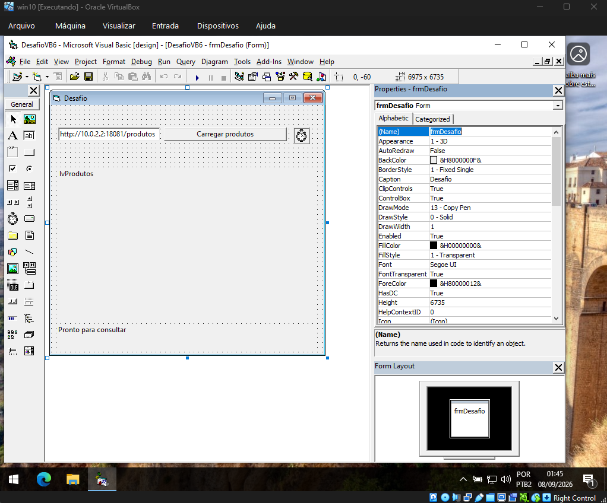
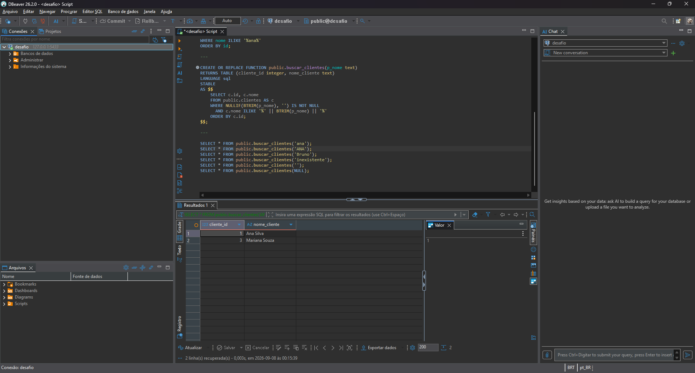
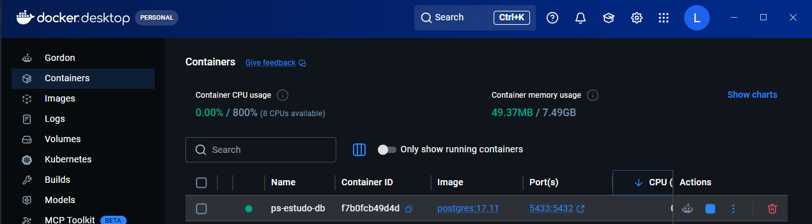

# Desafio técnico

Os três exercícios estão separados abaixo, na ordem de avaliação:

| Pasta | Conteúdo | Por onde começar |
| --- | --- | --- |
| [01-vb6](01-vb6) | Consulta REST com MSXML e ListView | [Instruções](01-vb6/README.md) e `DesafioVB6.vbp` |
| [02-csharp](02-csharp) | Windows Service de monitoramento e testes | [Instruções](02-csharp/README.md) |
| [03-postgresql](03-postgresql) | Busca de clientes com `ILIKE` | [postgresql.sql](03-postgresql/postgresql.sql) |

**O VB.NET foi feito somente por curiosidade e comparação com o VB6.** Está separado em [extras/vbnet](extras/vbnet) e não substitui a implementação VB6 solicitada.

A API de demonstração fica em `01-vb6/API`. O script PostgreSQL inclui a tabela, os dados de exemplo e as consultas. Os prints ficam em `docs/prints`.

`DesafioTecnico.slnx` abre apenas o exercício C# e seus testes. O VB6 deve ser aberto pelo próprio arquivo `.vbp`.

## Formulário VB6

## PostgreSQL

Busca por `ANA` no ambiente de testes, usando a função com `ILIKE`:

PostgreSQL em execução no Docker:

